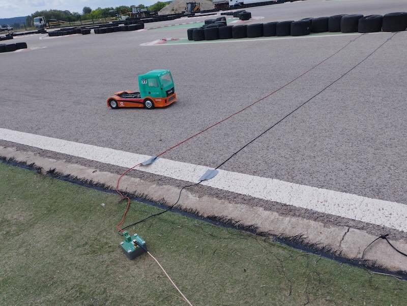

# Introduction

OpenStint is a lap timing solution for radio-controlled car and boat racing. It relies on magnetic coupling (near field):
* An active transponder creates a changing magnetic field, encoding a 7-digit identifier.
* A pickup antenna (loop) detects this signal when a vehicle passes over/under it.
* Decoding the signal happens on a computer (software-defined radio).
* A radio unit (HackRF One / RTL-SDR) downconverts and digitizes the signal for the computer.

While there are many alternative technologies, this one is probably the most fitting for motorsport application:
* Reliable in practically any conditions (dirt, rain, indoor & outdoor).
* The near-field signal strength decays with the distance-cubed (R3): measures a sigle lane, adjacent or nearby lanes do not create false passings.
* The loop is super-simple: a permanent installation survives the elements and abuse for years.
* Transponders are small and easy to mount, no line-of-sight is required.
* Hard to tamper.

No wonder this is the technology of choice for practially every professional event, including Formula-1. OpenStint makes this technology available for the amateur racing community.

## Technical details

Parameters were chosen, so OpenStint decoder can offer compatibility with existing AMBRc/MyLaps transponders, without significant overhead.

* 5 MHz carrier
* BPSK at 1.25 million symbols per second
* One transmission is 100-105 symbols (~80 us), the 24 bit payload protected by CRC8 and a convolutional code (K=9, r=1/2).
* Transmit rate randomized bewteen 0.8 - 2.2 ms (mean 1.5 ms).
* RTL-SDR supports 2.5 MSPS, HackRF One supports 2.5/5/10 MSPS.
