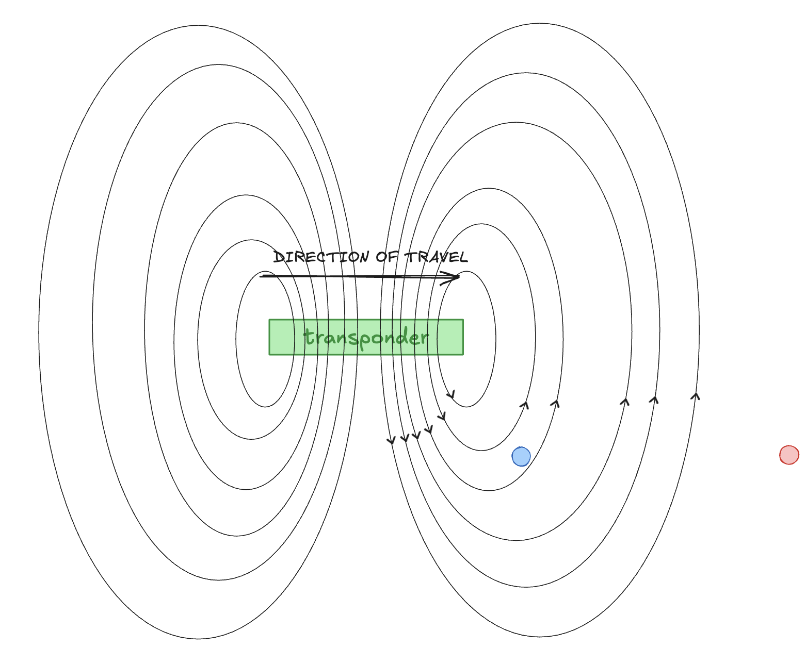
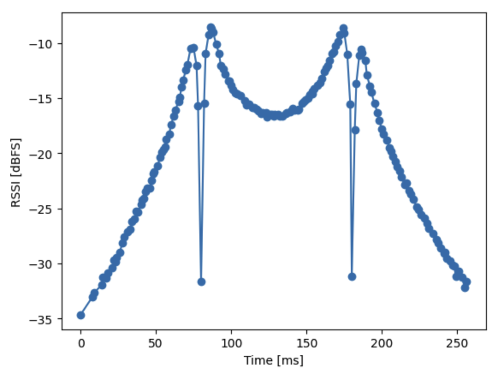
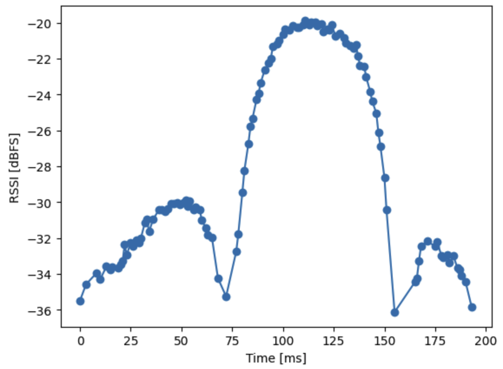
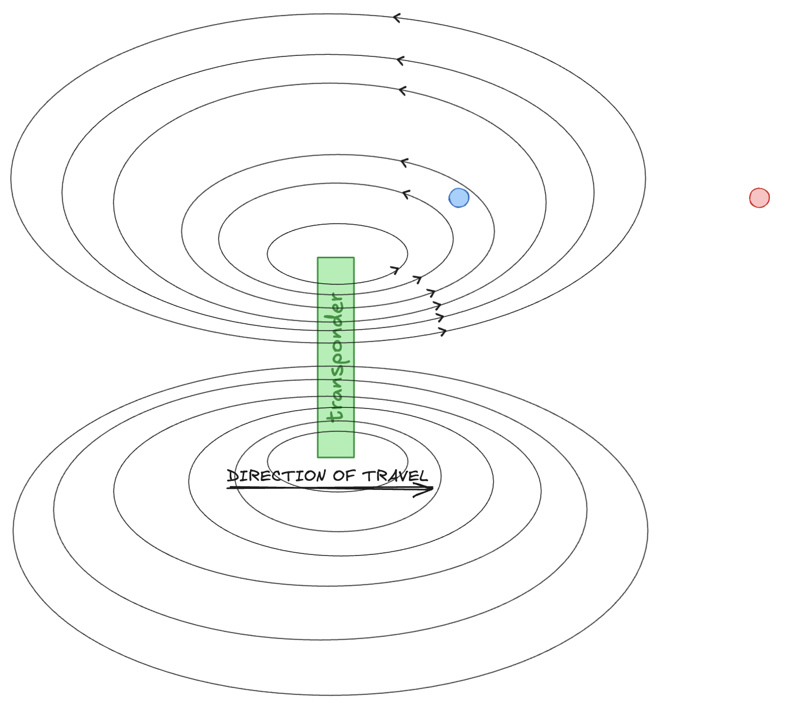
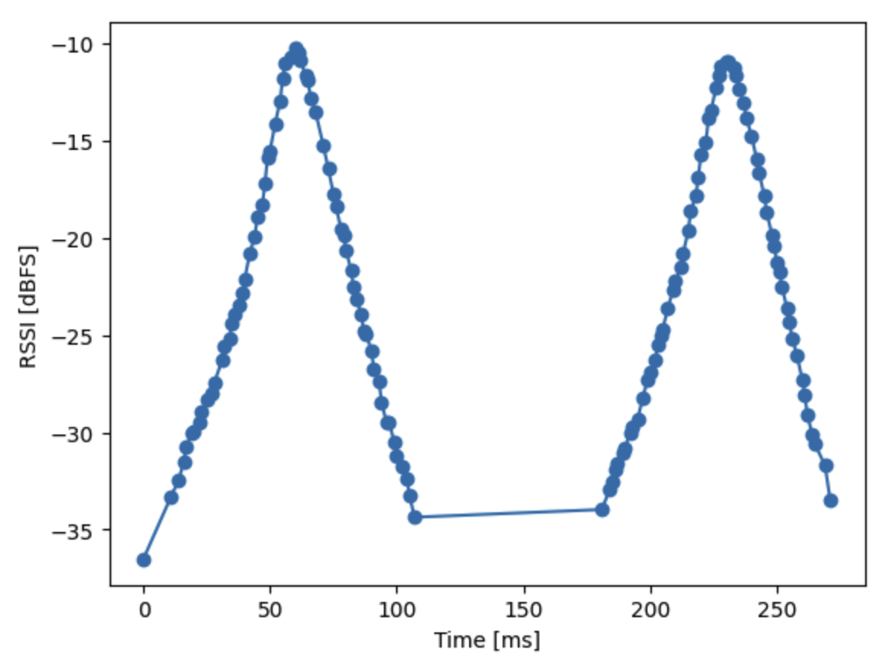
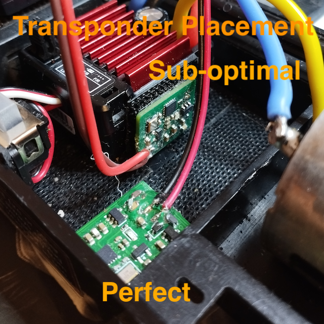

# Passing detection

Depending on the orientation of the transponder and its' distance and position from the loop, one can get vastly different signal strengths.

If you don't want to stay to nerd out, these are the main takeaways:
* There is only one correct transponder placement: transponder's plane is parallel to the antenna's plane.
* Lay down the pickup loop in a section where the lowest speed is at least 1 m/s. Certain transponder placements can result in two distinct peaks. To prevent double-detections, the car must pass the loop within 250 ms, hence the speed limit.

## Correct transponder placement: transmit coil is paralell to pickup loop

1. As the transponder is getting closer to the pickup loop, the magnetic fieldlines cross the loop, and gets detected.
2. There is a point, where as many down-pointing fieldlines cross the loop as upward-pointing, forming a zero. It happens when the transponder is approximately right over one of the wires.
3. As the transponder gets over the loop, downward-pointing fields become dominant
  * if the transponder is close the the loop, the down-pointing fieldlines are partially cancelled by upward-pointing ones
  * if the transponder is distant from the loop, the down-pointing fieldlines are dominant
4. As the transponder leaves the loop, the same process is happening in reverse

### Transponder close to the loop

### Transponder distant from the loop

## Transponder perpendicular to pickup loop

In this setup, the fieldlines cross the loop as the transponder closes and leaves the loop, and create a zero when the transponder is right in the middle. Maximum field strength is about when the transponder is somewhere before the loop.

## AVOID: transponder's plane is parallel to travel direction, perpendicular to pickup loop

In this arrangement fieldlines cancel each other out, and detection is theoretically not possible. In practice, conductive and ferromagetic parts on the vehicle might guide the fieldlines in a way there will be a detection though. These detections will be of lower signal strength.

## Preliminary results

In an artificial environment, the following double tranponder arrangement was able to:
* Reliably tell if the vehicle passed the loop forward or reverse (the transponders were placed ~15 mm from each other, and one transponder was detected a few miliseconds earlier than the other)
* Produce passing times within 2 miliseconds.

