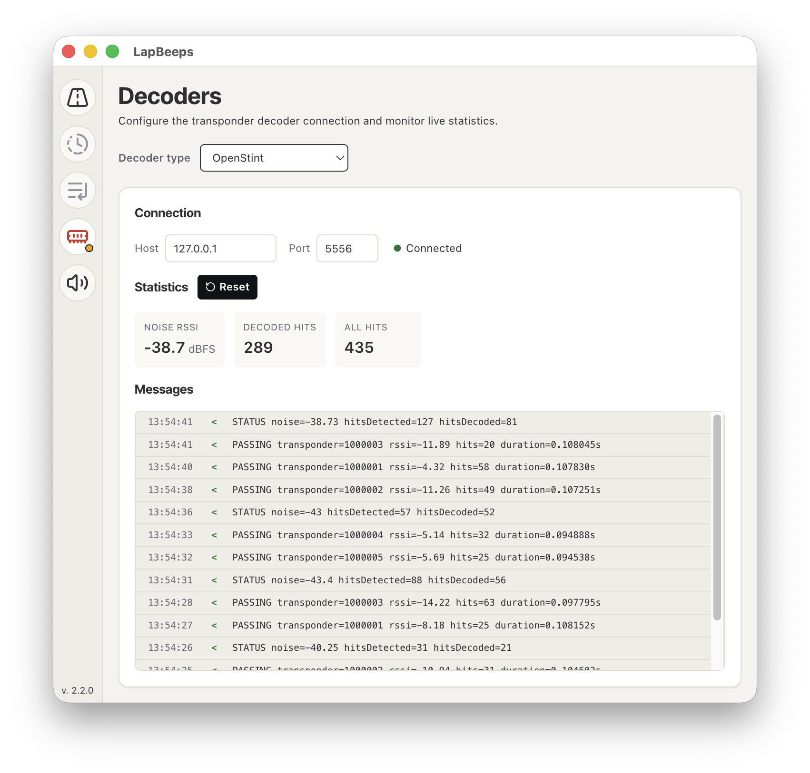

# LapBeeps

[LapBeeps](https://lapbeeps.com) is my take on a modern, multi-platform timing & race management software. It's free for offline use. Both OpenStint and [RCHourGlass](https://github.com/mv4wd/RCHourglass/) decoders are obviously supported natively.

