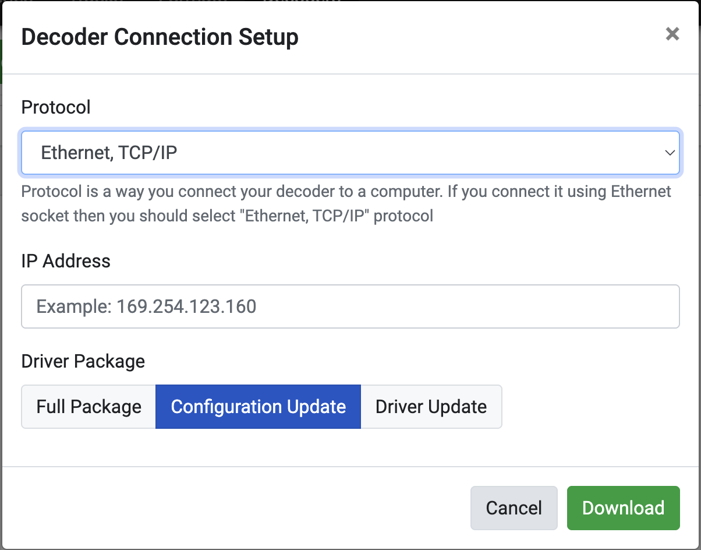

# RCGTiming

[RCGTiming](https://rcgtiming.com/) is an online timing and scoring platform. We have to use a small *bridge* that connects to an OpenStint decoder and relays the relevant messages to [their backend](https://rcgtiming.com/apidoc/index.html) via HTTP.

You have to get a free API key to use this integration:
1. Register to RCGTiming platform, login, go to "Decoders" tab
2. Download driver, select "Configuration update" only.
3. Extract the `.zip`, the API key is in `main.conf` (as `token`)

Use `token` as command line argument, without the quotes:
```
bridge-rcgtiming.exe --token PuJ...
```



