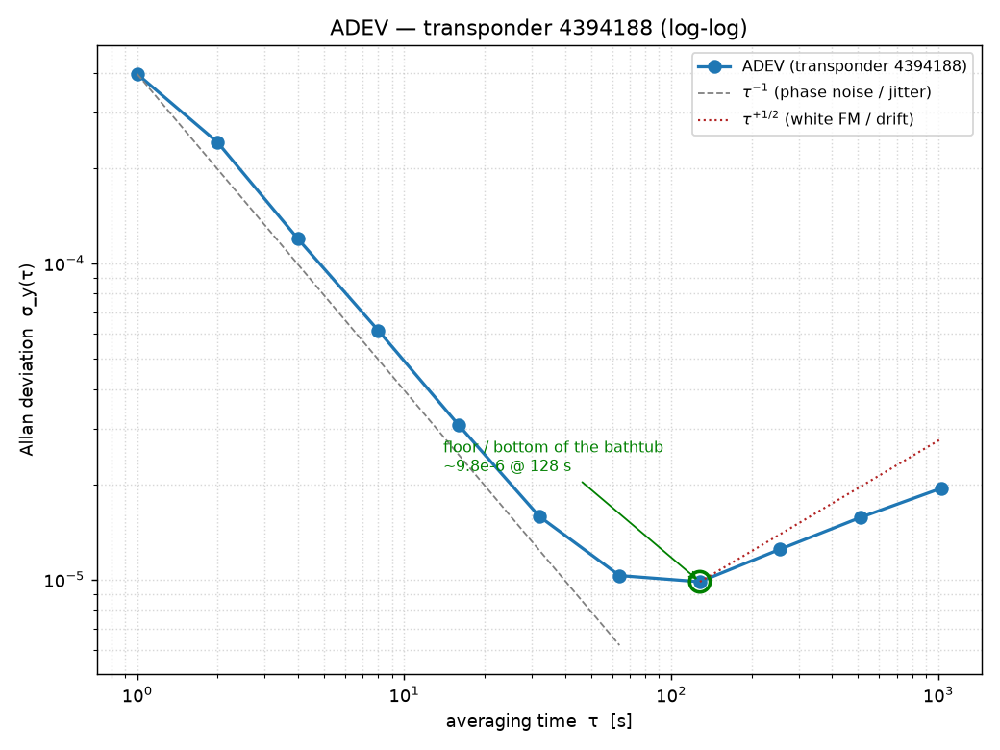

# Timing Accuracy

The time is measured on the host computer when the radio's buffer is processed. Unfortunately, there is no way to measure it using the radio (where it is actually received). The system can drop buffers at various levels of the stack (radio/usb/driver), and individual buffers have no serial number to track lost ones. We are at the mercy of the operating system's scheduler, giving an accuracy in the **410us ~ 10ms range**, depending on your configuration.

**TL;DR** typical error values over a 32 second lap (aka choosing hardware):
* M1 Macbook: better than 1 ms
* Raspberry Pi Model 3 B+: 0.5 ms
* Windows 10 on Intel platform: 3 ms; see setup down here!

## Measuring timing accuracy

Funfact: you can compare two clocks, but there is no as "absolute clock".

[Openstint-transponders](purchase-transponder.md) send a [timesync timecode](transponder-protocol.md#time-syncing-messages) every ca. 1000 ms. As the transponders are equipped with a good-enough crystal oscillator, we can compare the timecode and the receive timestamp, building statistics over time.

Park a car off-track but still in the loop with an openstint-transponder inside. Use the tool `timesync_pairstats` to build statistics.



## Sources of error

* NTP syncronization by slewing (Linux problem): handles small time gaps by slowing down or speedig up the local timer. This propagates down to the application. The error is in the 10-40 ppm range though.
* USB selective suspend / power management / Power plan throttling (Windows problem)
* Operating system's scheduler: the buffers are timestamped when they are processed, and this time is up to the operating system (and the system load). This creates a "flat noise" accross every time intervals, no matter if you measure 1 second laps or 1000 second laps.
* Drift (clocks not running at the same rate): 10 ppm difference is 1 ms over a 100 s window.
* Wandering: no clock is stable, the most likely cause of "wandering" is temperature change.
* USB controller & low level stuff: it's more like a theoretical problem, while the sources above are actually measurable phenomenas.

## Parsing timesync_pairstats output

The following measurement was made with an RTL-SDR and a Windows 10 laptop. The SDR dongle was the only USB defices plugged in. The `openstint_rtlsdr` was started in normal priority.

```
======================================================================================
timesync pair-stats  transponder 4394188  |  2230 messages processed
  locked onto transponder 4394188
  gap[s]   count      mean     stdev    median       min       max   90%spread
  ----------------------------------------------------------------------------
       1    2203    -0.042     2.701    -0.100    -6.500     6.100      ±4.495
       2    2202    -0.076     2.733    -0.100    -6.800     6.200      ±4.650
       4    2201    -0.166     2.651    -0.100    -6.400     6.200      ±4.450
       8    2196    -0.319     2.685    -0.300    -6.600     6.300      ±4.500
      16    2188    -0.619     2.706    -0.600    -6.900     5.900      ±4.600
      32    2172    -1.243     2.706    -1.300    -7.400     5.100      ±4.500
      64    2141    -2.486     2.667    -2.500    -8.800     3.900      ±4.400
     128    2082    -4.998     2.731    -5.000   -11.400     1.500      ±4.550
     256    1955    -9.981     2.679   -10.000   -16.400    -3.500      ±4.400
     512    1706   -20.032     2.626   -20.000   -26.500   -13.800      ±4.400
    1024    1200   -40.015     2.706   -40.000   -46.300   -33.700      ±4.600
    2048     203   -79.938     2.746   -80.100   -86.000   -73.800      ±4.490
  (all error values in ms; error = decoder_elapsed - transponder_elapsed)
======================================================================================
```

**Note:** "error" is the decoder's timestamp compared to the transponder's timecode!

The way to read it:
* On a typical, 16 second lap, the `stdev=2.719`, meanig
  * 68% of all 16-second laps have at most `±2.719 ms` error
  * 95% of such laps have at most `2x2.719=5.44 ms` error
  * 99.9% of all laps have `3x2.719=8.56 ms` error
* The calculation above is re-assured by actual measurements: no measured 16-second gap had larger error than (`max - min = 5.9 + 6.8 = 12.7 ms`), and 90% or all measurements were within `±4.400`.
* The *mean* and *median* doubles every octave: this is frequency drift. The clock of the host computer is ca. `20ms/512s = 39 ppm` slower than the transponder's clock. This is both normal and typical. Note: everyone's laptime is slewed.
* the `stddev` remains stable over the frequency ranges: the two clocks (transponder and host computer) are stable relative to each other. If one of them were drifting differently relative to the other, it would be visible on the timescale of the drifting.

## Windows tips-and-tricks

I'm seeing the least reliable measurements with a Windows 10 laptop (2013 Macbook Air) and an RTL-SDR. The exact reasons are still being investigated.

* Power plan → High Performance (or Ultimate Performance).
* Disable USB selective suspend: Power Options → plan settings → Advanced → USB settings → "USB selective suspend setting" → Disabled. And Device Manager → your SDR + each USB Root Hub → Power Management → uncheck "Allow the computer to turn off this device to save power."
* Exclude the decoder process from Windows Defender real-time scanning.
* Start using `start /high openstint_rtlsdr.exe ...` in high-priority mode.
